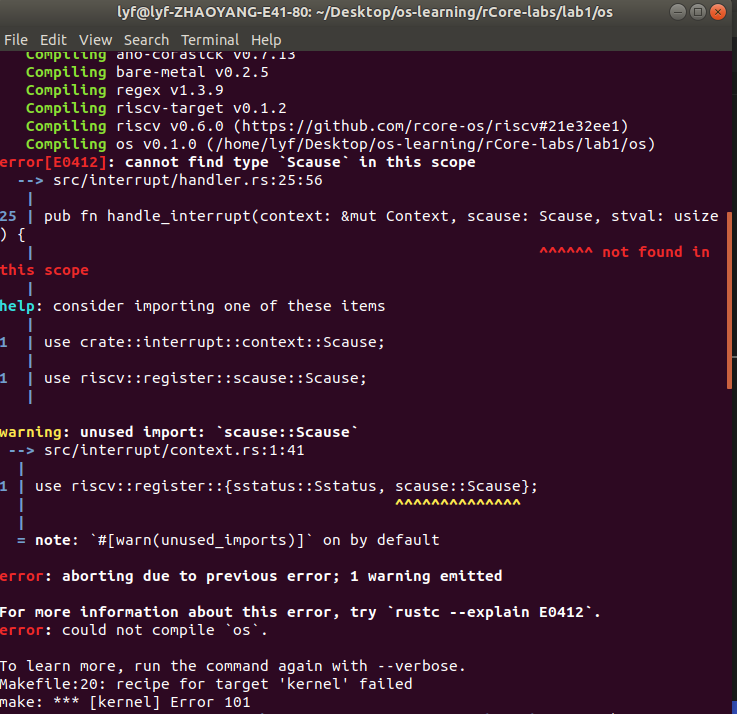
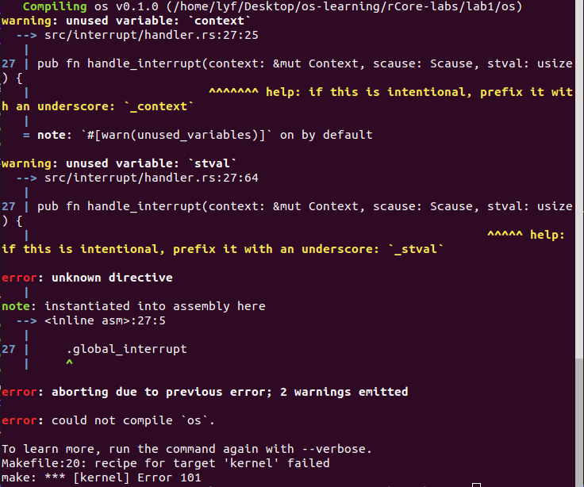
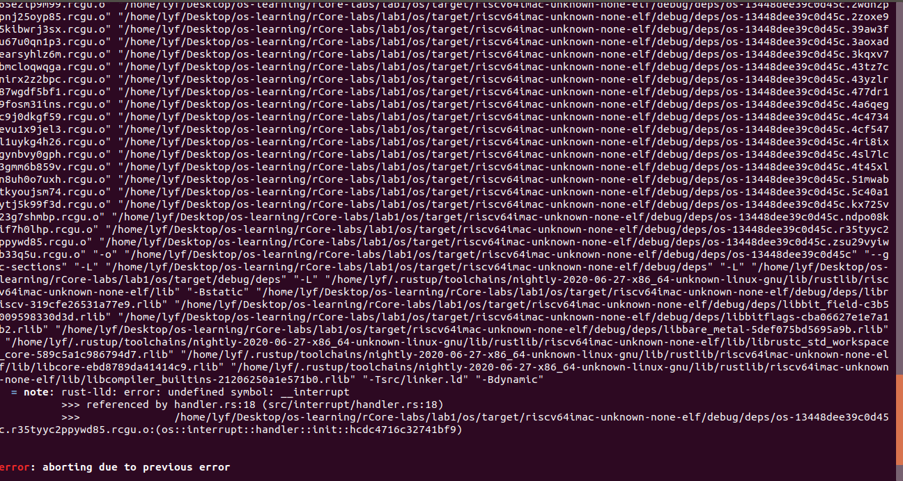
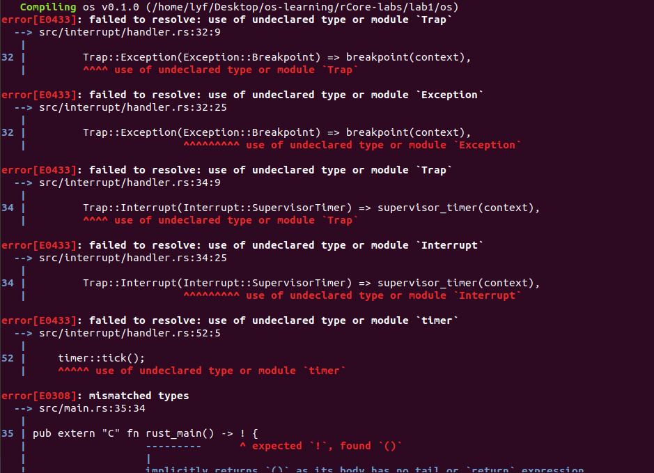
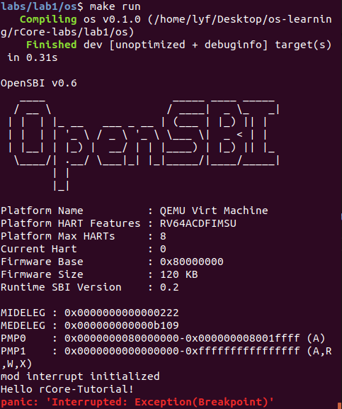
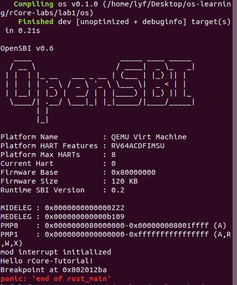
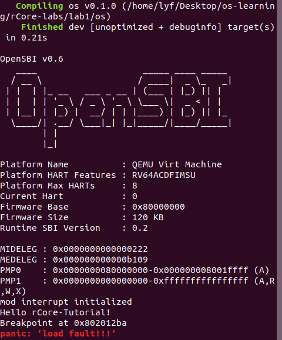
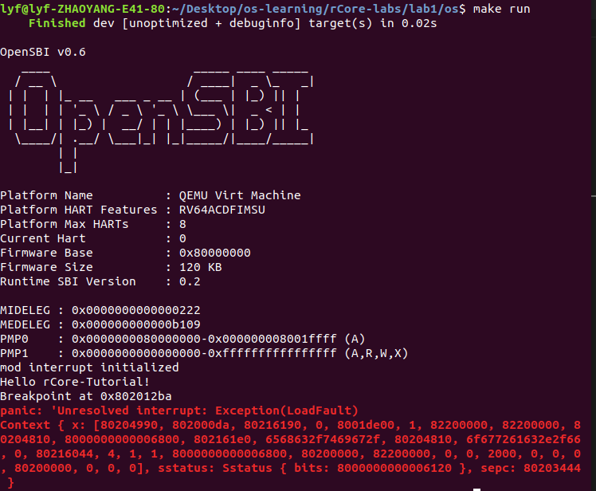
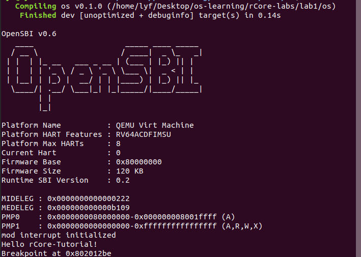

# lab1 notes

学到了什么：

- RISCV有关中断处理的寄存器和特权指令
- 中断相关流程
- 如何保存（中断）上下文
- 处理中断
  - 断点中断
  - 时钟中断


- 中断是什么？
  - 种类
    - 异常（Exception）：执行指令时产生
      - 可以恢复的
      - 导致用户程序被终止的
    - 陷阱（Trap）：导致中断的指令
      - 如系统调用
    - 硬件中断（Hardware Interrupt）
  - RISC-V 中断
    - 软件中断：SSIE/SSIP
    - 时钟中断：STIE/STIP
    - 外部中断：SEIE/SEIP
- CSR寄存器（中断相关）https://content.riscv.org/wp-content/uploads/2017/05/riscv-privileged-v1.10.pdf
  - 中断时，硬件自动填写的
    - `sepc`：触发中断的指令的地址
      - 延迟槽是什么？
      - 怎样恢复异常指令后下一条指令？
        - pc+当前指令长度
    - `scause`：是否硬件中断（中断原因）
    - `stval：没太看懂`
  - 指导硬件处理中断的
    - `stvec`：设置内核态中断处理流程的入口地址
      - 基址BASE
      - 模式MODE
        - Direct（0）：跳转到BASE执行
        - Vectored（1）：跳转`BASE+4×cause`执行
    - `sstatus`：状态位，控制全局中断使能
    - `sie：控制具体类型中断的使能`
    - `sip：记录每种中断是否被触发`
  - sscratch
    - 用户态，保存内核栈地址
    - 内核态，0
- 指令（中断相关）https://content.riscv.org/wp-content/uploads/2017/05/riscv-spec-v2.2.pdf
  - 进入和退出中断
    - `ecall`：触发中断
    - `sret`：内核态返回用户态
    - `ebreak`：触发断点
    - `mret：机器态返回内核态`
  - 操作CSR
    - csrrw dst, csr, src
    - csrr dst, csr
    - csrw csr, src
    - csrc(i) csr, rs1
    - csrs(i) csr, rs1
- 操作的保存和恢复
  - 程序运行状态保存
    - Context：保存通用寄存器和CSR寄存器（保存到栈上）
    - 怎样保存在栈上
      - `sp`-需要开辟的大小
  - 恢复
    - 栈->寄存器
  - 操作流程
- 进入中断处理流程
  - 开启中断
    - 入口
  - 处理中断
    - 中断处理流程
  - 触发中断
- 时钟中断
  - 开启时钟中断
  - 设置时钟种断
  - 实现处理流程


## Rust语法复习

- Cargo.toml加（外部）依赖
- 类的写法
- `#[repr(C)]`
- `#[derive(Debug)]`


## error

### 1



修改：

将context.rs文件中的 `use riscv::register::{sstatus::Sstatus, scause::Scause};` 改为`use riscv::register::sstatus::Sstatus;`

在handler.rs文件中加入`use riscv::register::scause::Scause;`

### 2



修改：

- 加_
- 打错了`.global __iterrupt`

### 3



修改：

- `interrupt.asm` 中掉了`__ieterrupt` 

### 4（时钟中断）



修改：

- handler.rs中加入`use riscv::register::{scause::{Scause, Exception, Interrupt, Trap}, stvec,};`
- rust_main函数返回类型不匹配：去掉返回！

### 运行结果







## 实验

### 1

- handler.rs 
  -  `handle_interrupt` 函数：match加一个处理访问不存在地址的异常分支：      Trap::Exception(Exception::LoadFault) => load_fault(context),
  - ``load_fault` 函数：

```rust
/// 处理访问不存在的地址
///
/// `panic!`
fn load_fault(_: &Context) {
    panic!("load fault!!!");
}
```

- main.rs
  - `rust_main`
    - 注释掉最后一行`panic!("end of rust_main");` 来测试访问异常地址
- `make run` 运行结果：（符合预期，已处理该异常）




- 若不进行异常处理，输出如下：




### 2

-  `load_fault` 函数
  - 修改参数，增加`stval
  - 增加 `if` 语句判断访问地址是否为0, 若是，打印“SUCCESS!"


### 3

1. 在`entry.asm ` 中 调用`rust_main后` 加入 `jr x0`



2. 在`entry.asm ` 中 调用`rust_main `后加入 `ld x1, (x0)`