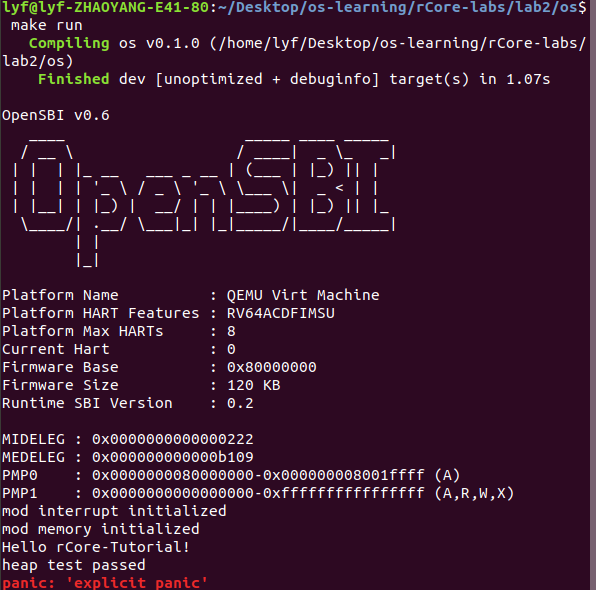
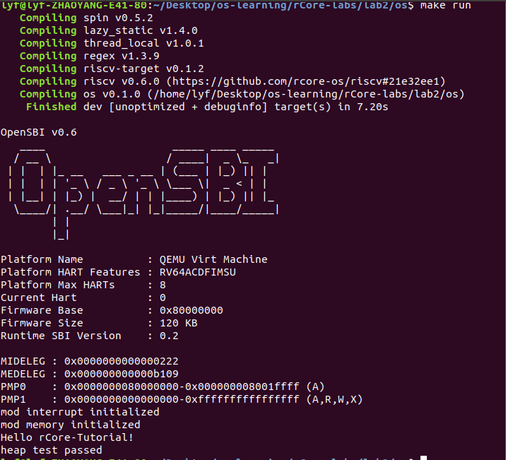
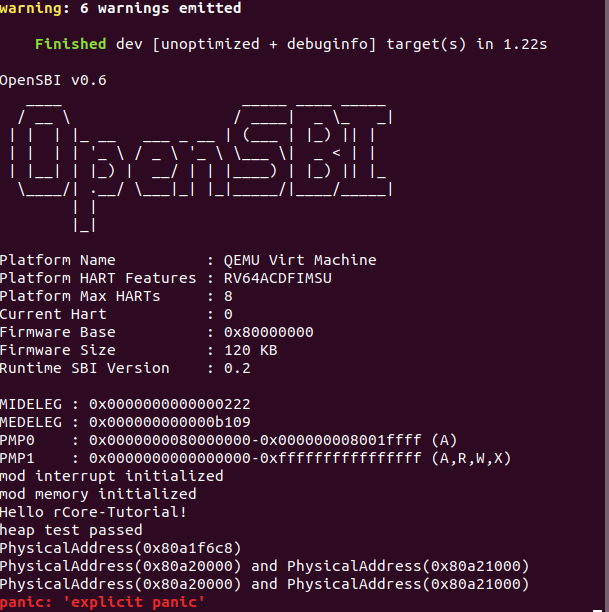

# lab2

学到了什么：

- 动态内存的分配
- QEMU模拟的RISC-V 计算机的物理内存
- 通过页的方式对物理内存进行管理

一些知识点：

- 内核中动态内存分配
  - `Box<T>`
  - 计数清零
    -  `Rc<T>`
    - `Arc<T>`
  - 标准库数据结构
    - `Vec`
    - `HashMap`
- trait怎样实现
- 怎样实现`Trait GlobalAlloc`
  - 标记
  - 分配连续的，大小至少为x字节的虚拟内存（对齐要求）
- 连续内存分配算法
  - 贪心，外碎片，碎片整理
  - 伙伴系统
  - SLAB
- 物理内存
  - 物理内存探测
    - OpenSBI
      - 对包括物理内存在内的各外设扫描，将结果以DTB格式保存在物理内存中
      - 将地址保存在`a1`
    - QEMU代码`virt_memmap[]`
  - 物理页
    - 分配物理内存以物理页（4KB）为单位
    - 物理页号PPN，表示范围 [PPN x 4KB, (PPN + 1) x 4KB]
    - 

### 1

- 模块完善
  - 增加`memory/mod.rs`
    - 初始化子模块
  - `Cargo.toml`
    - 增加依赖`buddy_system_allocator(0.3.0)`
  - `main.rs`
    - 增加模块`memory`
    - 外部crate`alloc`
    - unstable的功能说明
      - `#![feature(alloc_error_handler)]`

运行成功：

### 2

- 模块完善
  - `memory/config.rs`
    - 定义常量`PAGE_SIZE`
    - 加入使用`address`和`lazy_static`中内容
  - `Cargo.toml`
    - 加入依赖`lazy_static`

运行成功：

### 3

